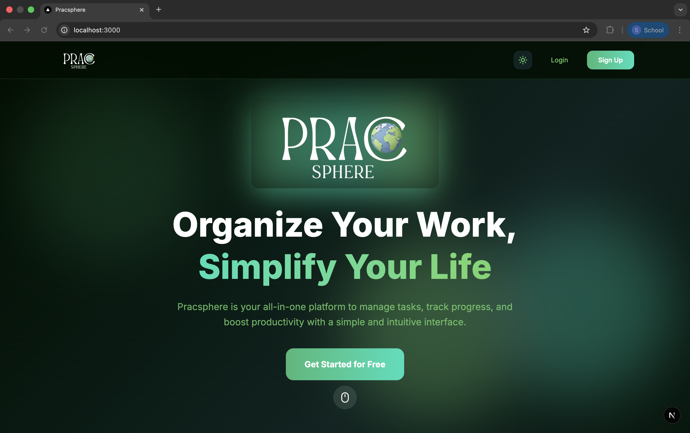
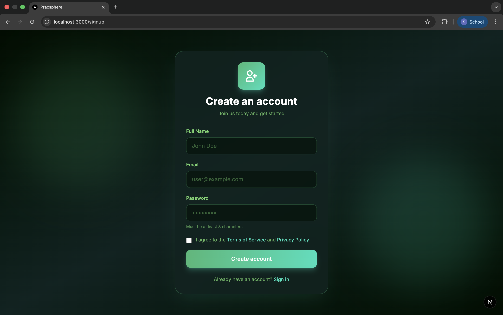
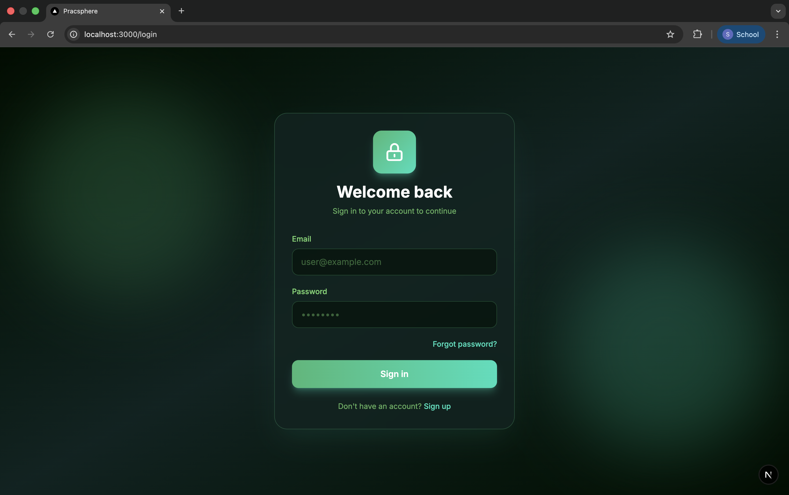
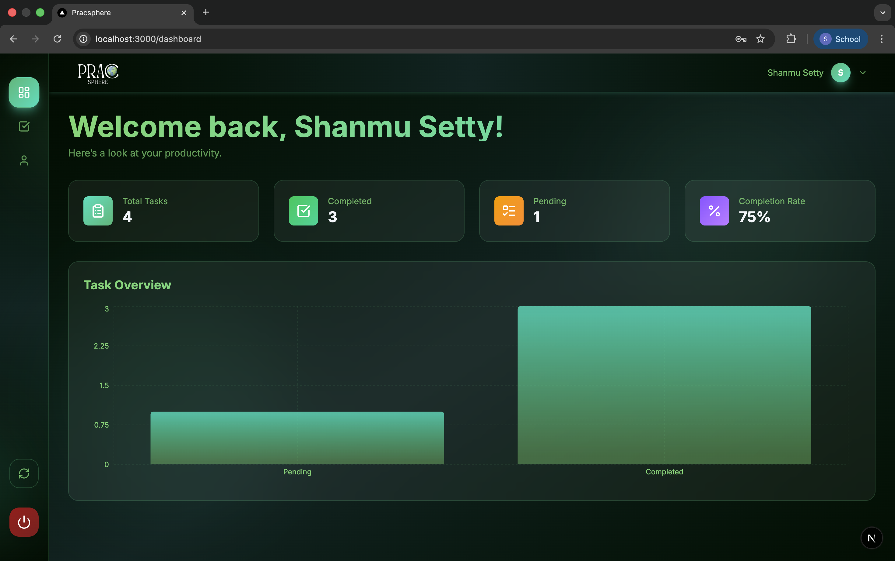
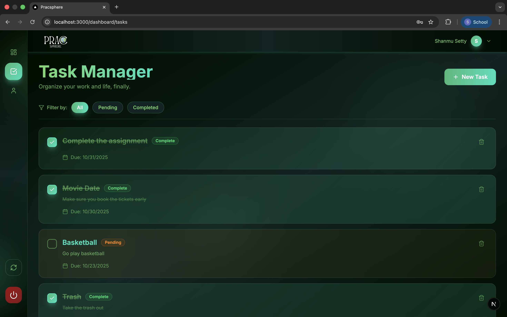
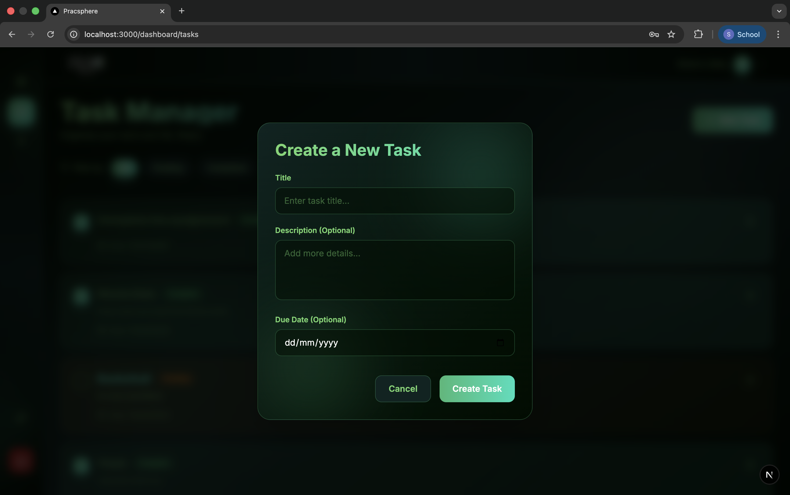
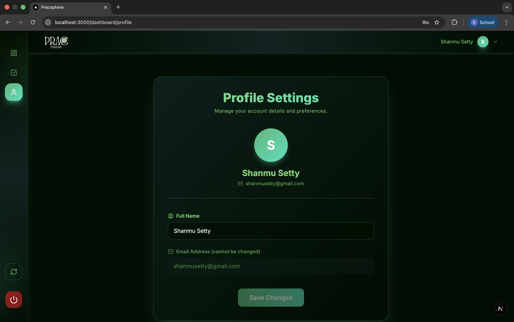

# PracSphere - Internship Assignment

This is my submission for the Full-Stack Developer internship assignment from Shel-B Technologies Private Limited. The application is a task manager built on a modern tech stack including Next.js, TypeScript, Tailwind CSS, and MongoDB.

## ✨ Features

-   **User Authentication:** Secure user signup and login functionality using NextAuth.
-   **Task Management:** A full CRUD (Create, Read, Update, Delete) interface for managing tasks.
-   **Dashboard:** An overview page displaying user-specific task statistics and a visual chart.
-   **Responsive Design:** A clean, modern UI that works seamlessly on both desktop and mobile devices.

---

## 🚀 Local Setup and Installation

Follow these steps to get the project running on your local machine.

1.  **Clone the Repository**
    ```bash
    git clone [https://github.com/ShanmuSetty/pracsphere-internship-assignment.git](https://github.com/ShanmuSetty/pracsphere-internship-assignment.git)
    cd pracsphere-assignment
    ```

2.  **Install Dependencies**
    This project uses `pnpm` as the package manager.
    ```bash
    pnpm install
    ```

3.  **Set Up Environment Variables**
    Create a new file named `.env` in the root of the project. Copy the contents from `.env.example` and fill in your actual **MongoDB URI** and a new, random string for **NEXTAUTH_SECRET**.

4.  **Run the Development Server**
    ```bash
    pnpm run dev
    ```

The application will now be available at `http://localhost:3000`.

---

## 📸 Screenshots

Here are the required screenshots of the application in action.

### Landing Page


### Signup Page


### Login Page


### Dashboard


### Task Manager


### Create Task Modal


### Profile Page

